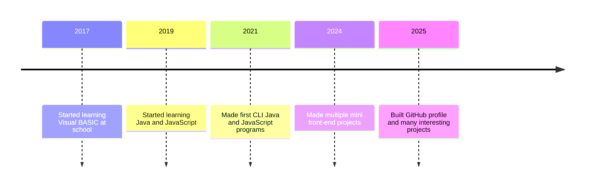

# Welcome to my GitHub profile⚡️

  

  
  
  

   
  

    
  

---

  

---

## 🧰 Tech Stack & Skills

---

## ⭐ Featured Projects (auto-generated cards)

  
  
  

---

## 🔬 Activity Timeline

---

## 📫 Contact & Hire

- Email: `sagnikmaitra01@gmail.com`
- Phone number: `+91-7980560474`
- LinkedIn: [Sagnik Maitra](https://www.linkedin.com/in/sagnikmaitra)
- Resume: [Click here to download](https://guthib.com)

---

Made with ❤️ and a touch of mild chaos 😉

