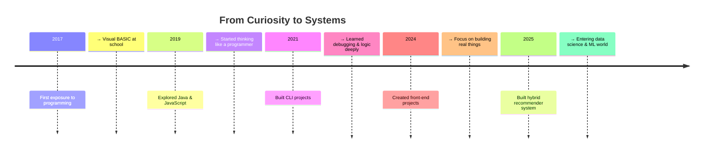

# ⚡️Welcome to my GitHub profile!

## 🧠 About Me

- 👨‍💻 Developer focused on **learning by building real-world projects**
- 📊 Exploring **full-stack development, artificial intelligence, machine learning, and other technologies**
- 🔍 Curious about how systems work **under the hood**
- 🚀 Moving from *“getting things to work” → “understanding why they work”*

## 📊 GitHub Analytics

  

  

---

<picture>
    <source media="(prefers-color-scheme: dark)" srcset="https://raw.githubusercontent.com/HeX-ecutioner/HeX-ecutioner/output/pacman-contribution-graph-dark.svg">
    <source media="(prefers-color-scheme: light)" srcset="https://raw.githubusercontent.com/HeX-ecutioner/HeX-ecutioner/output/pacman-contribution-graph.svg">
    
</picture>

## 🧰 Tech Stack & Skills

### 🧑‍💻 Languages

### 👉 Frontend Development

### 👈 Backend Development

### 🗃️ Database Management Systems

### 📐 Frameworks

### 📚 Libraries

  
  
  
  
  

### 🛠️ Developer Tools

---

## 🔬 Activity Timeline

```mermaid
timeline
    title From Curiosity to Systems

    2017 : First exposure to programming  
           → Visual BASIC at school  

    2019 : Explored Java & JavaScript  
           → Started thinking like a programmer  

    2021 : Built CLI projects  
           → Learned debugging & logic deeply  

    2024 : Created front-end projects  
           → Focus on building real things  

    2025 : Built hybrid recommender system  
           → Entering data science & ML world
```

## 📫 Contact & Hire

- Email: `sagnikmaitra01@gmail.com`
- Phone number: `+91-7980560474`
- LinkedIn: [Sagnik Maitra](https://www.linkedin.com/in/sagnikmaitra)